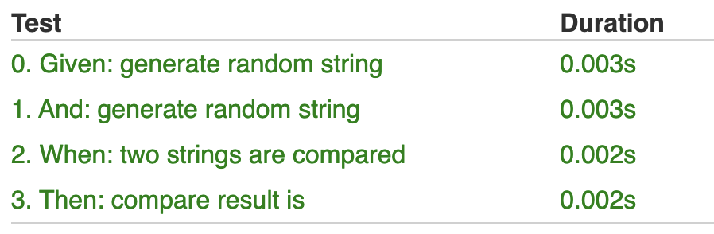
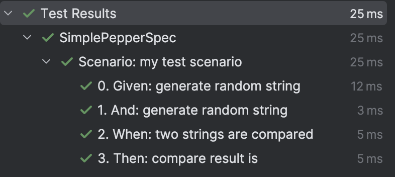

# pepper-bdd
BDD library that automatically discovers "steps" in your test class and executes each one of them as a separate jUnit test.

This is implemented as a compiler plugin by modifying code of your test spec.

Based on [kotest](https://github.com/kotest/kotest)

# Example
```kotlin
class SimplePepperSpec : PepperSpec({
    Scenario("my test scenario") {
        Given
        val firstRandom = `generate random string`("first")
        val secondRandom = `generate random string`("second")

        When
        val compareResult = `two strings are compared`(firstRandom, secondRandom)

        Then
        `compare result is`(compareResult, false)
    }
})
```




# Usage
Project is not yet published to [Gradle Plugins Portal](https://plugins.gradle.org/), 
so you need to add plugin dependency manually via the `buildscript` section.

```kotlin
buildscript {
    dependencies {
        classpath("io.github.vooft:pepper-bdd-gradle:<version>")
    }
}

apply(plugin = "io.github.vooft.pepper-bdd")
```

Also you need to add `pepper-bdd-core` dependency to your project.

```kotlin
dependencies {
    testImplementation("io.github.vooft:pepper-bdd-core:<version>")
}
```

After this you can create a test by inheriting from `io.github.vooft.pepper.PepperSpec` and compiler will pick it up automatically.

If you didn't add any steps, or forgot to add a plugin, an exception will be thrown on test execution.
