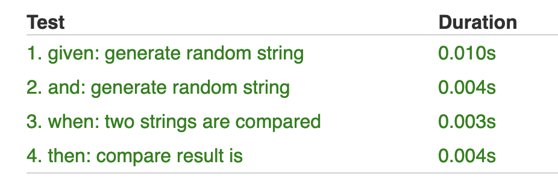

# pepper-bdd
BDD library that automatically discovers "steps" in your test class and executes each one of them as a separate jUnit test.

This is implemented as a compiler plugin by modifying code of your test spec.

Based on [kotest](https://github.com/kotest/kotest)

# Example
```kotlin
class SimplePepperSpec : PepperSpec({
    Scenario("my test scenario") {
        Given
        val firstRandom = `generate random string`("first")
        val secondRandom = `generate random string`("second")

        When
        val compareResult = `two strings are compared`(firstRandom, secondRandom)

        Then
        `compare result is`(compareResult, false)
    }
})
```


