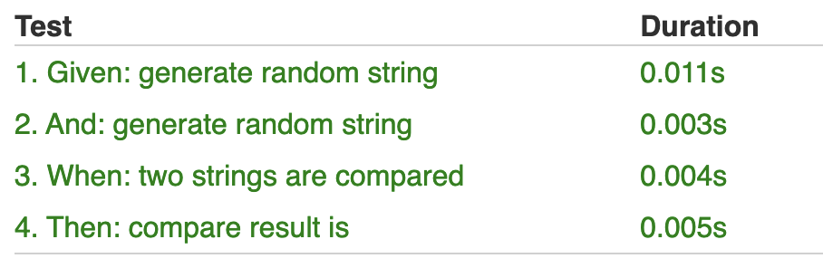
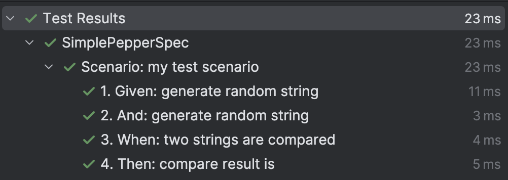
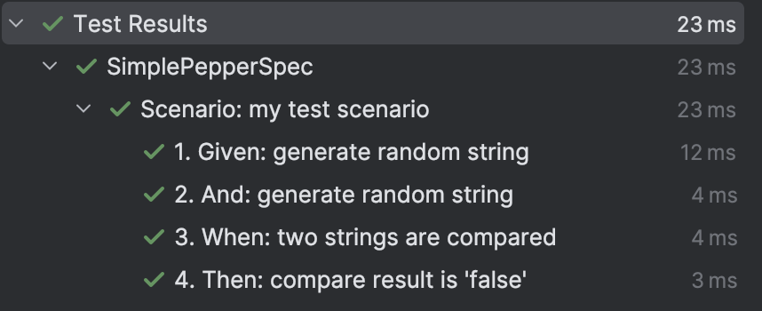
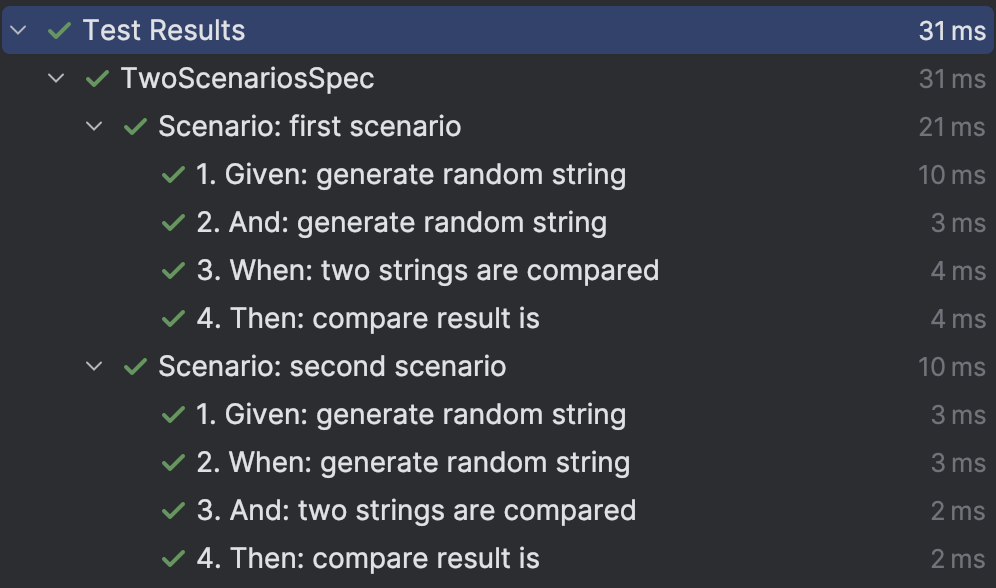
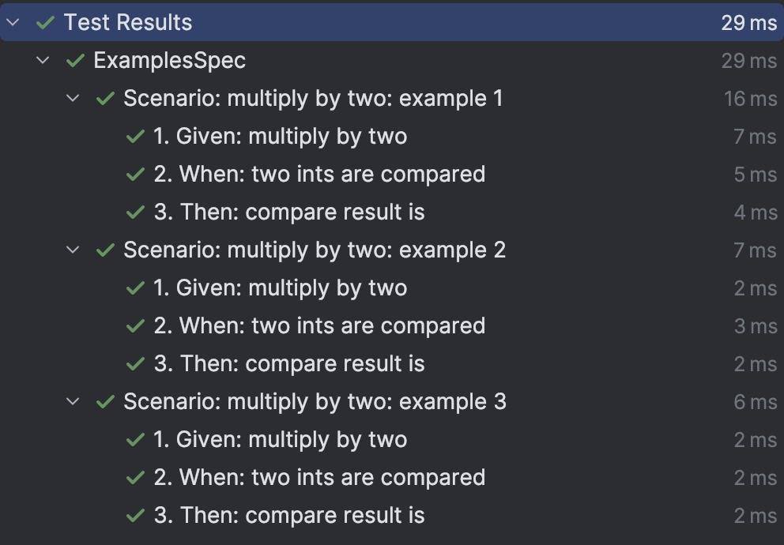

# pepper-bdd
BDD library that automatically discovers "steps" in your test class and executes each one of them as a separate jUnit test.

This is implemented as a compiler plugin by modifying code of your test spec.

Based on [kotest](https://github.com/kotest/kotest)

# Example
## Simple scenarios
```kotlin
class SimplePepperSpec : PepperSpec({
    Scenario("my test scenario") {
        Given
        val firstRandom = `generate random string`("first")
        val secondRandom = `generate random string`("second")

        When
        val compareResult = `two strings are compared`(firstRandom, secondRandom)

        Then
        `compare result is`(compareResult, false)
    }
})
```




## Placeholders in step names
```kotlin
// step with placeholder in its name
// string inside curly braces will be replaced with actual value from the arguments, if there is no match, it will stay as-is 
// it is possible to use dollar sign in a method name, but intellij can't handle it properly and will show that the method is not used, even though it is
@Step
fun `compare result is {expected}`(compareResult: CompareResult, expected: Boolean) {
    assert(compareResult.result == expected) { "Expected $expected, but got ${compareResult.result}" }
}

class SimplePepperSpec : PepperSpec({
    Scenario("my test scenario") {
        Given
        val firstRandom = `generate random string`("first")
        val secondRandom = `generate random string`("second")

        When
        val compareResult = `two strings are compared`(firstRandom, secondRandom)

        Then
        // just call the method normally, the plugin will replace the placeholder with the actual value
        `compare result is {expected}`(compareResult, false)
    }
})
```



## Multiple scenarios per spec
```kotlin
class TwoScenariosSpec : PepperSpec({
    Scenario("first scenario") {
        Given
        val firstRandom = `generate random string`("first")
        val secondRandom = `generate random string`("second")

        When
        val compareResult = `two strings are compared`(firstRandom, secondRandom)

        Then
        `compare result is`(compareResult, false)
    }

    Scenario("second scenario") {
        Given
        val firstRandom = `generate random string`("first")

        When
        val secondRandom = `generate random string`("second")
        val compareResult = `two strings are compared`(firstRandom, secondRandom)

        Then
        `compare result is`(compareResult, false)
    }
})
```



## Scenarios with examples
```kotlin
class ExamplesSpec : PepperSpec({
    ScenarioExamples("multiply by two") {
        "example 1" { Example(input = 1, result = 2, compareResult = true) }
        "example 2" { Example(input = 2, result = 4, compareResult = true) }
        "example 3" { Example(input = 3, result = 5, compareResult = false) }
    } Outline {
        Given
        val multiplication = `multiply by two`(example.input)

        When
        val compareResult = `two ints are compared`(multiplication, example.result)

        Then
        `compare result is`(compareResult, example.compareResult)
    }
})

data class Example(val input: Int, val result: Int, val compareResult: Boolean)
```



# Usage
Project is not yet published to the Gradle Plugins Portal, so you need to add plugin dependency manually via the `buildscript` section.

```kotlin
buildscript {
    dependencies {
        classpath("io.github.vooft:pepper-bdd-gradle:<version>")
    }
}

apply(plugin = "io.github.vooft.pepper-bdd")
```

Also you need to add `pepper-bdd-core` dependency to your project.

```kotlin
dependencies {
    testImplementation("io.github.vooft:pepper-bdd-core:<version>")
}
```

After this you can create a test by inheriting from `io.github.vooft.pepper.PepperSpec` and compiler will pick it up automatically.

If you didn't add any steps, or forgot to add a plugin, an exception will be thrown on test execution.
